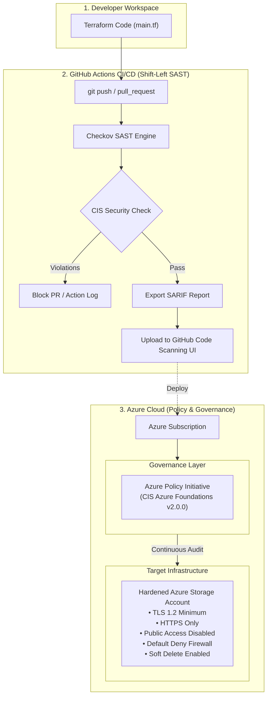

# 🛡️ DevSecOps CI/CD Pipeline with Terraform & Checkov

## Lab Overview:
The purpose of this lab is to gain hands-on experience with Infrastructure as Code (IaC), Automated DevSecOps Pipelines, and Cloud Governance by declaratively provisioning hardened Azure cloud resources using Terraform.

### 🧰 Tool Set:
- VS Code
- Git
- GitHub Actions
- Terraform (azurerm)
- Azure CLI
- Checkov (Bridgecrew)
- Azure Verified Modules
- CIS Microsoft Azure Foundations Benchmark v2.0.0
- Documentation for each product
- Gemini as a tutor

## Part 1. Preparation
Installing VS Code and all necessary extensions. Creating the "Dev-sec-ops-lab" folder, initializing tools, authenticating, and verifying everything works:

```
# Installing Terraform extension in VS Code via GUI and verifying it works

terraform init
terraform -help
```
```
# Installing Azure CLI via PowerShell  

Invoke-WebRequest -Uri https://aka.ms/installazurecliwindows -OutFile .\AzureCLI.msi; Start-Process msiexec.exe -Wait -ArgumentList '/I AzureCLI.msi /quiet'; rm .\AzureCLI.msi`
 
az login

# Setting the active subscription with Azure CLI
 
az account set --subscription "subscription-id"

#  Creating a Service Principal (an application within Azure Active Directory/Entra ID containing the authentication tokens Terraform needs to perform actions on your behalf)

az ad sp create-for-rbac --role="Contributor" --scopes="/subscriptions/<SUBSCRIPTION_ID>"

# Setting environment variables. HashiCorp recommends setting these values as environment variables rather than saving them directly in your Terraform configuration

  $Env:ARM_CLIENT_ID = "<APPID_VALUE>"
  $Env:ARM_CLIENT_SECRET = "<PASSWORD_VALUE>"
  $Env:ARM_SUBSCRIPTION_ID = "<SUBSCRIPTION_ID>"
  $Env:ARM_TENANT_ID = "<TENANT_VALUE>"
```

## Part 2. Writing Insecure Infrastructure Code & Initial Commit
Creating the main.tf file and making the initial Git commit. The main.tf file is the primary configuration file used in Terraform to define core infrastructure resources, data sources, and module calls.

Taking the Terraform configuration from the tutorial as a base, modifying the location, name, and provider version, and introducing two explicit security vulnerabilities into the configuration:

```
# Configure the Azure provider
terraform {
  required_providers {
    azurerm = {
      source  = "hashicorp/azurerm"
      version = "~> 5.6.0"
    }
  }
  required_version = ">= 1.1.0"
}

provider "azurerm" {
  features {}
}

# The required Resource Group
resource "azurerm_resource_group" "lab" {
  name     = "devsecops-lab-rg"
  location = "Western Europe"
}

# The vulnerable Storage Account
resource "azurerm_storage_account" "lab" {
  name                     = "insecurelabstorage9988" 
  resource_group_name      = azurerm_resource_group.lab.name
  location                 = azurerm_resource_group.lab.location
  account_tier             = "Standard"
  account_replication_type = "LRS"
  
  # VULNERABILITY 1: Allowing public access
  public_network_access_enabled = true
  
  # VULNERABILITY 2: Forcing minimum TLS to an outdated version
  min_tls_version = "TLS1_0"
}
```
```
# Making the initial commit using Git:
git init
git add main.tf
git commit -m "Initial commit with vulnerable storage account"
git remote add origin https://github.com/Glebius01/Lab
git branch -M main
git push -u origin main
```

## Part 3. Creating the GitHub Actions Pipeline
Creating a hidden folder structure and file at this path: .github/workflows/security-scan.yml

This workflow uses actions/checkout@v4 to pull the repository code and runs the scanner directly inside Checkov's official Docker container to prevent unnecessary compute overhead:
```
    name: Checkov Security Scan
    
    on:
      push:
        branches: [ "master", "main" ]
    
    jobs:
      scan-infrastructure:
        runs-on: ubuntu-latest
        # Run directly inside the lightweight Checkov container
        container:
          image: bridgecrew/checkov:latest
    
    steps:
        - name: Checkout Code
          uses: actions/checkout@v4
        - name: Run Checkov
          run: checkov -d . --framework terraform
```

## Part 4. Validating SAST Guardrails & Troubleshooting
The aim of this step is to validate that SAST works and prevents the deployment of vulnerable code. However, here I had an issue - because Terraform I initialised Terraform locally, it created provider binaries that exceeded GitHub's file size limit (100MB+). Additionally, while I was trying to resolve the issue, I piled up unpushed commits.

I managed to resolve the issues using these commands:

```
# 1. Force-delete the hidden .terraform folder from disk
Remove-Item -Recurse -Force .terraform -ErrorAction SilentlyContinue

# 2. Reset local Git branch history to start completely fresh
git reset --hard

# 3. Create a .gitignore file so Git never tracks .terraform again
Set-Content .gitignore ".terraform/`n*.tfstate`n*.tfstate.backup"
```

Repeating the attempt - commit, push, and in GitHub Actions we can observe that Checkov failes the deployment - thus, we successfully built a "Shift-Left" pipeline that intercepted misconfigured IaC code at its inception. 

Besides the 2 vulnerabilities I deliberately left in the code, Checkov conducted 9 more checks signalling logging & data protection issues, and insecure credentials access. Each of these checks have a URL with detailed remediation guidance to configure secure version of the container should we need it.


```
Check: CKV_AZURE_190: "Ensure that Storage blobs restrict public access"
FAILED for resource: azurerm_storage_account.lab
File: /main.tf:21-35

Check: CKV_AZURE_44: "Ensure Storage Account is using the latest version of TLS encryption"
FAILED for resource: azurerm_storage_account.lab
File: /main.tf:21-35
```

## Part 5. Making Storage Account CIS-Compliant

Now the task is to actually pass all those checks! Initially, I changed Checkov framework to CIS-AZURE but it returned an error. This was not necessary because Checkov parses .tf files and automatically evaluates its entire built-in policy library against them—including rules mapped to CIS, NIST, PCI-DSS, and HIPAA. While researching this, I also added a feature to output SARIF reports and upload them via the CodeQL action, which provides developers with inline PR remediation advice and gives security teams centralised visibility over code-level vulnerabilities.

Next, I assigned the CIS Azure Foundations Benchmark Initiative at the Azure Subscription level using Policy as Code. I initially didn't realise that this provides compliance/governance at the cloud level rather than locally, but through this, I achieved Defense-in-Depth—ensuring that even if an out-of-band change occurs outside of CI/CD, the cloud management plane actively audits and blocks non-compliant configurations.

Eventually, instead of adding 50+ lines of raw code or writing custom Terraform modules from scratch, I imported Azure Verified Modules (AVM) to leverage secure-by-default building blocks. I had to omit several checks (using inline #checkov:skip directives) as they required a virtual network, dedicated logging services, and Key Vault HSMs infrastructure that is out of scope for this standalone lab.

---
```
# Configure the Azure provider
terraform {
  required_providers {
    azurerm = {
      source  = "hashicorp/azurerm"
      version = "~> 3.0"
    }
  }
  required_version = ">= 1.1.0"
}

provider "azurerm" {
  features {}
}

# 1. Resource Group
resource "azurerm_resource_group" "lab" {
  name     = "devsecops-lab-rg"
  location = "Western Europe"
}

# ---------------------------------------------------------
# CLOUD GOVERNANCE: CIS INITIATIVE ASSIGNMENT
# ---------------------------------------------------------

data "azurerm_subscription" "current" {}

data "azurerm_policy_set_definition" "cis" {
  display_name = "CIS Microsoft Azure Foundations Benchmark v2.0.0"
}

resource "azurerm_subscription_policy_assignment" "cis" {
  name                 = "lab-cis-benchmark"
  display_name         = "Lab CIS Azure Foundations Benchmark"
  subscription_id      = data.azurerm_subscription.current.id
  policy_definition_id = data.azurerm_policy_set_definition.cis.id
  location             = "Western Europe"

  identity {
    type = "SystemAssigned"
  }
}

# ---------------------------------------------------------
# ---------------------------------------------------------
# INFRASTRUCTURE HARDENING: COMPLIANT STORAGE ACCOUNT
# ---------------------------------------------------------

resource "azurerm_storage_account" "lab" {
#checkov:skip=CKV2_AZURE_1: "Managed by Azure platform-managed keys for standalone lab scope."
#checkov:skip=CKV2_AZURE_33: "Private endpoints omitted for standalone lab environment without VNet."
#checkov:skip=CKV_AZURE_33: "Queue logging handled via subscription-level Azure Monitor diagnostic settings."

  name                     = "securelabstorage9988"
  resource_group_name      = azurerm_resource_group.lab.name
  location                 = azurerm_resource_group.lab.location
  account_tier             = "Standard"
  account_replication_type = "GRS"

  public_network_access_enabled   = false
  min_tls_version                 = "TLS1_2"
  allow_nested_items_to_be_public = false
  https_traffic_only_enabled      = true
  shared_access_key_enabled       = false

  network_rules {
    default_action = "Deny"
    bypass         = ["AzureServices"]
  }

  blob_properties {
    delete_retention_policy {
      days = 7
    }
    container_delete_retention_policy {
      days = 7
    }
  }

  infrastructure_encryption_enabled = true
}
```


## Visual Diagram



