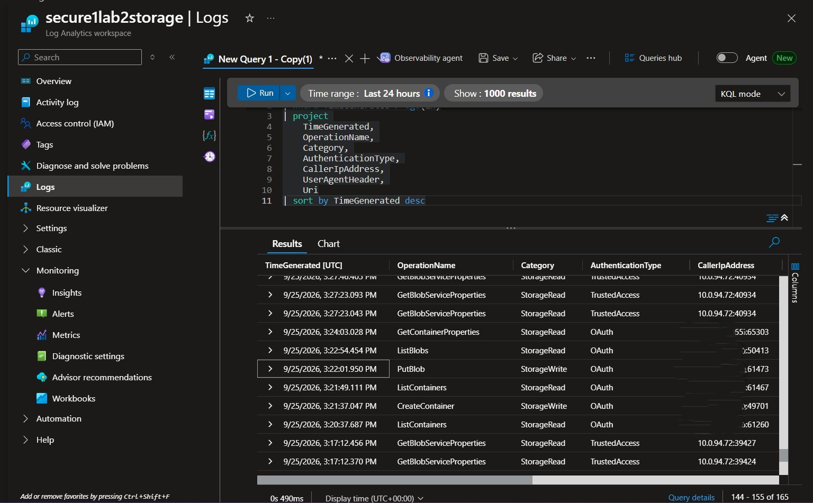

# 🛡️ DevSecOps CI/CD Pipeline with Terraform & Checkov

## Lab Overview

The purpose of this lab is to gain hands-on experience with Infrastructure as Code (IaC), DevSecOps Pipelines, Cloud Governance and Identity and Access Management (IaM) by declaratively provisioning hardened Azure cloud resources using Terraform.

### 🧰 Tool Set:
- VS Code
- Git
- GitHub Actions
- Terraform (azurerm)
- Azure CLI
- Checkov (Bridgecrew)
- Azure Verified Modules
- CIS Microsoft Azure Foundations Benchmark v2.0.0
- Documentation for each product
- Gemini as a tutor

## Part 1. Preparation

Installing VS Code and all necessary extensions. Creating the "Dev-sec-ops-lab" folder, initialising tools, authenticating, and verifying everything works:

```
# Installing Terraform extension in VS Code via GUI and verifying it works

terraform init
terraform -help
```
```
# Installing Azure CLI via PowerShell  

Invoke-WebRequest -Uri https://aka.ms/installazurecliwindows -OutFile .\AzureCLI.msi; Start-Process msiexec.exe -Wait -ArgumentList '/I AzureCLI.msi /quiet'; rm .\AzureCLI.msi`
 
az login

# Setting the active subscription with Azure CLI
 
az account set --subscription "subscription-id"

#  Creating a Service Principal (an application within Azure Active Directory/Entra ID containing the authentication tokens Terraform needs to perform actions on your behalf)

az ad sp create-for-rbac --role="Contributor" --scopes="/subscriptions/<SUBSCRIPTION_ID>"

# Setting environment variables. HashiCorp recommends setting these values as environment variables rather than saving them directly in your Terraform configuration

  $Env:ARM_CLIENT_ID = "<APPID_VALUE>"
  $Env:ARM_CLIENT_SECRET = "<PASSWORD_VALUE>"
  $Env:ARM_SUBSCRIPTION_ID = "<SUBSCRIPTION_ID>"
  $Env:ARM_TENANT_ID = "<TENANT_VALUE>"
```

## Part 2. Writing Insecure Infrastructure Code & Initial Commit

Creating the main.tf file and making the initial Git commit. The main.tf file is the primary configuration file used in Terraform to define core infrastructure resources, data sources, and module calls.

Taking the Terraform configuration from the tutorial as a base, modifying the location, name, and provider version, and introducing two explicit security vulnerabilities into the configuration:

```
# Configure the Azure provider
terraform {
  required_providers {
    azurerm = {
      source  = "hashicorp/azurerm"
      version = "~> 5.6.0"
    }
  }
  required_version = ">= 1.1.0"
}

provider "azurerm" {
  features {}
}

# The required Resource Group
resource "azurerm_resource_group" "lab" {
  name     = "devsecops-lab-rg"
  location = "Western Europe"
}

# The vulnerable Storage Account
resource "azurerm_storage_account" "lab" {
  name                     = "insecurelabstorage9988" 
  resource_group_name      = azurerm_resource_group.lab.name
  location                 = azurerm_resource_group.lab.location
  account_tier             = "Standard"
  account_replication_type = "LRS"
  
  # VULNERABILITY 1: Allowing public access
  public_network_access_enabled = true
  
  # VULNERABILITY 2: Forcing minimum TLS to an outdated version
  min_tls_version = "TLS1_0"
}
```
```
# Making the initial commit using Git:
git init
git add main.tf
git commit -m "Initial commit with vulnerable storage account"
git remote add origin https://github.com/Glebius01/Lab
git branch -M main
git push -u origin main
```

## Part 3. Creating the GitHub Actions Pipeline

Creating a hidden folder structure and file at this path: .github/workflows/security-scan.yml

This workflow uses actions/checkout@v4 to pull the repository code and runs the scanner directly inside Checkov's official Docker container to prevent unnecessary compute overhead:
```
    name: Checkov Security Scan
    
    on:
      push:
        branches: [ "master", "main" ]
    
    jobs:
      scan-infrastructure:
        runs-on: ubuntu-latest
        # Run directly inside the lightweight Checkov container
        container:
          image: bridgecrew/checkov:latest
    
    steps:
        - name: Checkout Code
          uses: actions/checkout@v4
        - name: Run Checkov
          run: checkov -d . --framework terraform
```

## Part 4. Validating SAST Guardrails & Troubleshooting

The aim of this step is to validate that SAST works and prevents the deployment of vulnerable code. However, here I had an issue - because Terraform I initialised Terraform locally, it created provider binaries that exceeded GitHub's file size limit (100MB+). Additionally, while I was trying to resolve the issue, I piled up unpushed commits.

I managed to resolve the issues using these commands:

```
# 1. Force-delete the hidden .terraform folder from disk
Remove-Item -Recurse -Force .terraform -ErrorAction SilentlyContinue

# 2. Reset local Git branch history to start completely fresh
git reset --hard

# 3. Create a .gitignore file so Git never tracks .terraform again
Set-Content .gitignore ".terraform/`n*.tfstate`n*.tfstate.backup"
```

Repeating the attempt - commit, push, and in GitHub Actions we can observe that Checkov failes the deployment - thus, we successfully built a "Shift-Left" pipeline that intercepted misconfigured IaC code at its inception. 

Besides the 2 vulnerabilities I deliberately left in the code, Checkov conducted 9 more checks signalling logging & data protection issues, and insecure credentials access. Each of these checks have a URL with detailed remediation guidance to configure secure version of the container should we need it.


```
Check: CKV_AZURE_190: "Ensure that Storage blobs restrict public access"
FAILED for resource: azurerm_storage_account.lab
File: /main.tf:21-35

Check: CKV_AZURE_44: "Ensure Storage Account is using the latest version of TLS encryption"
FAILED for resource: azurerm_storage_account.lab
File: /main.tf:21-35
```

## Part 5. Making Storage Account CIS-Compliant

Now the task is to actually pass all those checks! Initially, I changed Checkov framework to CIS-AZURE but it returned an error. This was not necessary because Checkov parses .tf files and automatically evaluates the code against its entire built-in policy library, which includes CIS, NIST, PCI-DSS, and HIPAA. While researching this, I also added a feature to output SARIF reports and upload them via the CodeQL action, which provides developers with inline PR remediation advice and gives security teams centralised visibility over code-level vulnerabilities.

Next, I assigned the CIS Azure Foundations Benchmark Initiative at the Azure Subscription level using Policy-as-Code. I initially didn't realise that this provides compliance/governance at the cloud level rather than locally, but through this, I achieved Defense-in-Depth—ensuring that even if an out-of-band change occurs outside of CI/CD, the cloud management plane actively audits and blocks non-compliant configurations.

Eventually, instead of adding 50+ lines of raw code or writing custom Terraform modules from scratch, I imported Azure Verified Modules (AVM) to leverage secure-by-default building blocks. I had to omit several checks (using inline #checkov:skip directives) as they required a virtual network, dedicated logging services, and Key Vault HSMs infrastructure that is out of scope for now.

---
```
# Configure the Azure provider
terraform {
  required_providers {
    azurerm = {
      source  = "hashicorp/azurerm"
      version = "~> 3.0"
    }
  }
  required_version = ">= 1.1.0"
}

provider "azurerm" {
  features {}
}

# 1. Resource Group
resource "azurerm_resource_group" "lab" {
  name     = "devsecops-lab-rg"
  location = "Western Europe"
}

# ---------------------------------------------------------
# CLOUD GOVERNANCE: CIS INITIATIVE ASSIGNMENT
# ---------------------------------------------------------

# This block is responsible for assigning the CIS Microsoft Azure Foundations Benchmark v2.0.0 policy set to the current subscription. The CIS benchmark is a widely recognized set of best practices for securing cloud environments, and applying this policy set helps ensure that the Azure resources in the subscription adhere to these security standards.

# Data block is for looking up existing things. In this instance it fetches the current subscription ID and the CIS benchmark policy set definition.

data "azurerm_subscription" "current" {}

data "azurerm_policy_set_definition" "cis" {
  display_name = "CIS Microsoft Azure Foundations Benchmark v2.0.0"
}

resource "azurerm_subscription_policy_assignment" "cis" {
  name                 = "lab-cis-benchmark"
  display_name         = "Lab CIS Azure Foundations Benchmark"
  subscription_id      = data.azurerm_subscription.current.id #instructs where to assign the policy set (current subscription)
  policy_definition_id = data.azurerm_policy_set_definition.cis.id #instructs which policy set to assign (CIS benchmark)
  location             = "Western Europe"

  identity {
    type = "SystemAssigned"
  }
}

# ---------------------------------------------------------
# INFRASTRUCTURE HARDENING: COMPLIANT STORAGE ACCOUNT
# ---------------------------------------------------------

resource "azurerm_storage_account" "lab" {
#checkov:skip=CKV2_AZURE_1: "Managed by Azure platform-managed keys for standalone lab scope."
#checkov:skip=CKV2_AZURE_33: "Private endpoints omitted for standalone lab environment without VNet."
#checkov:skip=CKV_AZURE_33: "Queue logging handled via subscription-level Azure Monitor diagnostic settings."

  name                     = "securelabstorage9988"
  resource_group_name      = azurerm_resource_group.lab.name
  location                 = azurerm_resource_group.lab.location
  account_tier             = "Standard"
  account_replication_type = "GRS"

  public_network_access_enabled   = false
  min_tls_version                 = "TLS1_2"
  allow_nested_items_to_be_public = false
  https_traffic_only_enabled      = true
  shared_access_key_enabled       = false

  network_rules {
    default_action = "Deny"
    bypass         = ["AzureServices"]
  }

  blob_properties {
    delete_retention_policy {
      days = 7
    }
    container_delete_retention_policy {
      days = 7
    }
  }

  infrastructure_encryption_enabled = true
}
```


## Part 6. Creating a storage container, implementing zero trust identities and logging

Identity is the new perimeter. Thus, I decided to expand the lab by creating a read-only machine identity and secretless write/delete access according to Zero Trust principles:

1. Secretless authentication: By using a User-Assigned Managed Identity (authentication into Azure CLI), the application can authenticate to Azure services without the need for storing credentials or secrets in the code or configuration files.

2. Micro-segmentation: The identity is isolated and has limited access, reducing the potential impact of a security breach.

3. Role-based access control (RBAC): The identity can be assigned specific roles and permissions, allowing for fine-grained access control to Azure resources.

4. Continious monitoring and auditing storage activities for evaluating and investigating user's activity

```
#--------------
# Identity.tf
#--------------

# This block assigns the "Storage Blob Data Reader" role to the User-Assigned Managed Identity created above. This allows the identity to read data from Azure Storage blobs, which is necessary for applications that need to access storage resources securely.

resource "azurerm_user_assigned_identity" "app_identity" {
  name                = "lab-app-identity"
  resource_group_name = azurerm_resource_group.lab.name
  location            = azurerm_resource_group.lab.location
}

# Resource block Creates the permission bridge.
# Scope restricts the identity's permissions only to this specific storage account, limiting the "blast radius" in case of a security breach.
# Role definition specifies the exact permissions granted to the identity, in this case, read-only access to blob data.
# Principal ID links the role assignment to the specific User-Assigned Managed Identity created earlier, ensuring that only this identity has the specified access rights.
# Skip service principal is specfied to avoid potential crashes during the role assignment process, especially in scenarios where the identity might not yet be fully propagated in Azure's backend systems.

resource "azurerm_role_assignment" "storage_reader" { 
  scope                            = azurerm_storage_account.lab.id 
  role_definition_name             = "Storage Blob Data Reader"
  principal_id                     = azurerm_user_assigned_identity.app_identity.principal_id
  skip_service_principal_aad_check = true 
}

# -------------------------------------------------------------------------------------------------------------------------------

# 1. Fetch the identity of a human currently logged into Azure CLI
data "azurerm_client_config" "current" {}

# 2. Grant the human Data Plane access to upload/delete files
resource "azurerm_role_assignment" "human_contributor" {
  scope                = azurerm_storage_account.lab.id
  role_definition_name = "Storage Blob Data Contributor"
  principal_id         = data.azurerm_client_config.current.object_id
}
```
---

```
#--------------
# Identity.tf
#--------------

# This block is responsible for creating a Log Analytics workspace and configuring diagnostic settings for an Azure Storage account to send logs and metrics to the workspace. This setup is essential for monitoring and auditing storage activities, which is a key aspect of Zero Trust and SecOps.

resource "azurerm_log_analytics_workspace" "secops" {
  name                = "secure1lab2storage"
  location            = azurerm_resource_group.lab.location
  resource_group_name = azurerm_resource_group.lab.name
  sku                 = "PerGB2018"
  retention_in_days   = 30
}

resource "azurerm_monitor_diagnostic_setting" "blob_logs" {
  name                       = "blob-audit-logging"
  target_resource_id         = "${azurerm_storage_account.lab.id}/blobServices/default" # Specfies the resource for monitoring.
  log_analytics_workspace_id = azurerm_log_analytics_workspace.secops.id

# This section enables logging for specific event types.

  enabled_log {
    category = "StorageRead"
  }
  
  enabled_log {
    category = "StorageWrite"
  }
  
  enabled_log {
    category = "StorageDelete"
  }
  
# This section enables metrics for the storage account, allowing for performance and usage monitoring.

  metric { 
    category = "Transaction"
    enabled  = true
  }
}
``` 
---
To be able to access the storage account from my personal PC (public network) I had to create a variable in a dedicated .tf file, where it fetches my current IP that is stored in a sensitive file - terraform.tfvars. Then, I had to whitelist it in main.tf or alternatively, via Azure GUI. In any case, turning on public access fails Checkov scan, so I had to exclude the rule from checks.

Eventually, I provisioned the container using benefits of a trial version of Azure account, uploaded a honeyfile and enumerated directory. I validated that logging works by running KQL query on Azure.
---
```
variable "my_ip" {
  description = "My local IP address for testing"
  type        = string
  sensitive   = true
}
```
```
network_rules {
    default_action = "Deny"
    bypass         = ["AzureServices"]
    ip_rules       = [var.my_ip]
  }
```



## Lab Chart

graph TD
    subgraph Control_Plane ["CONTROL PLANE (Identity & Provisioning)"]
        A["Local Admin / CI/CD"] -->|"Terraform Apply"| B["Azure Resource Manager (ARM)"]
        A -->|"az login"| C["Microsoft Entra ID (Azure AD)"]
        C -->|"RBAC Assignment (Storage Blob Data Contributor)"| D["Entra ID Principal / Service Principal"]
        
        subgraph DevSecOps ["DevSecOps Static Analysis"]
            E["Checkov / IaC Scanner"] -->|"Scans Code against CIS Benchmarks"| A
        end
    end

    subgraph Data_Plane ["DATA PLANE (Enforced Network & Access Limits)"]
        F["Whitelisted Admin IP"] -->|"OAuth Token + HTTPS"| G["Storage Firewall (Default: Deny)"]
        H["Unauthorized / Public IPs"] -->|"Blocked by Firewall Rules"| G
        
        G -->|"shared_access_key_enabled = false"| I["Secretless OAuth Enforcement"]
        D -.->|"Authorized via Entra ID Token"| I
        
        I --> J["Private Blob Container: test-data"]
    end

    subgraph Telemetry ["MONITORING & SEC OPS"]
        J -->|"Data-Plane Telemetry (PutBlob, GetBlob)"| K["Diagnostic Settings (/blobServices/default)"]
        K -->|"Streams Audit Logs"| L["Log Analytics Workspace"]
        M["SOC / Detection Engineer"] -->|"KQL Telemetry Audit (AuthenticationType == OAuth)"| L
    end

    %% Styling
    classDef control fill:#1f2937,stroke:#3b82f6,stroke-width:2px,color:#fff;
    classDef data fill:#111827,stroke:#10b981,stroke-width:2px,color:#fff;
    classDef monitoring fill:#1e1b4b,stroke:#8b5cf6,stroke-width:2px,color:#fff;
    
    class Control_Plane,DevSecOps control;
    class Data_Plane data;
    class Telemetry monitoring;
